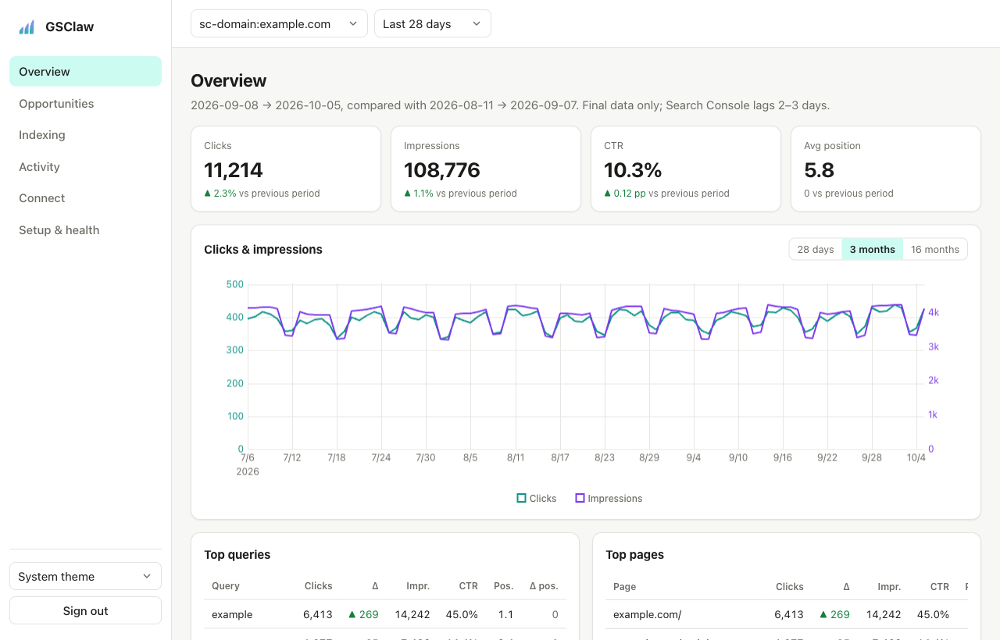
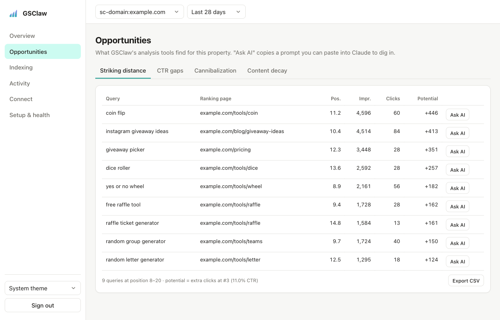
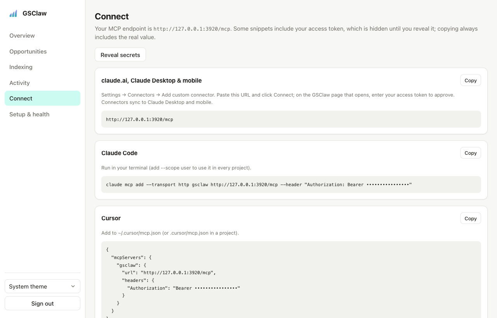
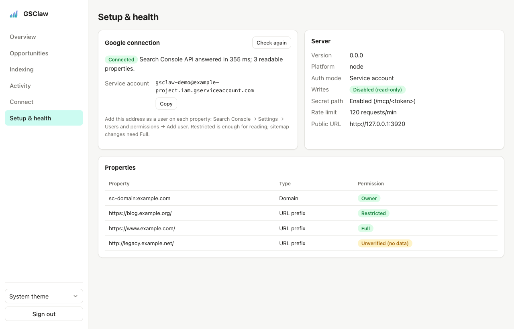
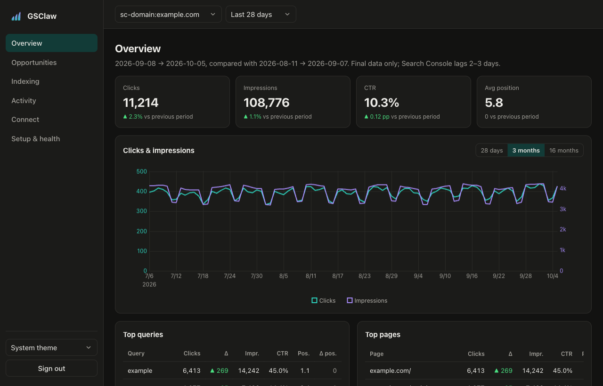

<p align="center">
  
</p>

<h1 align="center">GSClaw</h1>

<p align="center"><strong>Sink your claws into your Search Console data.</strong></p>

<p align="center">
  An open-source MCP server that gives Claude, ChatGPT, Cursor and other AI assistants first-party
  access to Google Search Console. Deploy it in one click, connect it from claude.ai, and ask your
  SEO questions in plain language.
</p>

<p align="center">
  <a href="https://github.com/tuyakhov/gsclaw/actions/workflows/ci.yml"></a>
  <a href="LICENSE"></a>
  <a href="https://modelcontextprotocol.io"></a>
</p>

<p align="center">
  <picture>
    <source media="(prefers-color-scheme: dark)" srcset="docs/images/overview-dark.png">
    
  </picture>
</p>

## Ask your AI things like

- _"Which queries are stuck on page two with lots of impressions, and what should I change on each
  page?"_
- _"Compare the last 28 days with the same period last year. What drove the difference?"_
- _"Where do two of my pages compete for the same query?"_
- _"Which blog posts have been losing clicks for three months straight?"_
- _"Is /pricing indexed? Which canonical did Google choose, and when was it last crawled?"_
- _"Run a full SEO health check on my site."_

## Why GSClaw

- **Works where you already chat.** A remote MCP endpoint over HTTPS for claude.ai (web, desktop
  and mobile), ChatGPT, Claude Code, Cursor and VS Code, plus local stdio.
- **Answers, not raw rows.** Analysis tools find striking-distance keywords, CTR gaps,
  cannibalization and decaying content, and compare periods, returning compact results that fit
  in your AI's context.
- **Your data stays yours.** GSClaw runs on your own account and talks straight to Google's API.
  There is no third-party service and no database; it stores nothing.
- **One-click deploys.** Vercel, Netlify, Cloudflare Workers, Render, Railway, DigitalOcean, or
  any Docker host.
- **A dashboard included.** See the same numbers your AI sees, find opportunities, and copy
  connection snippets.
- **Secure by default.** Refuses to start without authentication, signs clients in with OAuth
  2.1, and stays read-only unless you enable writes.

## Get started

1. **Create a Google service account** and add its email to your Search Console properties
   ([setup guide](docs/setup.md), about 10 minutes).
2. **Deploy** with a button and paste two values: `GOOGLE_SERVICE_ACCOUNT_JSON` (the key) and
   `GSCLAW_ACCESS_TOKEN` (a long random secret; Render and Railway generate it for you).

   [](<https://vercel.com/new/clone?repository-url=https%3A%2F%2Fgithub.com%2Ftuyakhov%2Fgsclaw&env=GOOGLE_SERVICE_ACCOUNT_JSON,GSCLAW_ACCESS_TOKEN&envDescription=Service-account%20key%20JSON%20and%20a%20long%20random%20access%20token%20(openssl%20rand%20-hex%2032)&envLink=https%3A%2F%2Fgithub.com%2Ftuyakhov%2Fgsclaw%2Fblob%2Fmain%2Fdocs%2Fsetup.md&project-name=gsclaw&repository-name=gsclaw>)
   [](https://app.netlify.com/start/deploy?repository=https://github.com/tuyakhov/gsclaw)
   [](https://deploy.workers.cloudflare.com/?url=https://github.com/tuyakhov/gsclaw)
   [](https://render.com/deploy?repo=https://github.com/tuyakhov/gsclaw)
   [](https://railway.com/deploy/gsclaw?utm_medium=integration&utm_source=button&utm_campaign=gsclaw)
   [](https://cloud.digitalocean.com/apps/new?repo=https://github.com/tuyakhov/gsclaw/tree/main)

   Or run the Docker image anywhere:

   ```bash
   docker run -p 3000:3000 \
     -e GOOGLE_SERVICE_ACCOUNT_JSON="$(cat service-account.json)" \
     -e GSCLAW_ACCESS_TOKEN="$(openssl rand -hex 32)" \
     ghcr.io/tuyakhov/gsclaw
   ```

   Platform notes (free tiers, timeouts, updates): [deploy guide](docs/deploy/README.md).

3. **Connect your AI.** Open your deployment, sign in with the access token, and copy a snippet
   from the **Connect** page. For claude.ai: Settings → Connectors → Add custom connector → paste
   `https://<your-deployment>/mcp` → Connect, then approve with your access token.

Several people with different Search Console access? Use [Google OAuth mode](docs/oauth.md)
instead: everyone signs in with their own Google account and only sees their own properties.

## Connect any client

| Client                             | How                                                                                                             |
| ---------------------------------- | --------------------------------------------------------------------------------------------------------------- |
| claude.ai, Claude Desktop & mobile | Settings → Connectors → Add custom connector → `https://<your-deployment>/mcp`                                  |
| Claude Code                        | `claude mcp add --transport http gsclaw https://<your-deployment>/mcp`, then `/mcp` to sign in                  |
| Cursor                             | `{ "mcpServers": { "gsclaw": { "url": "https://<your-deployment>/mcp" } } }` in `~/.cursor/mcp.json`            |
| VS Code                            | `{ "servers": { "gsclaw": { "type": "http", "url": "https://<your-deployment>/mcp" } } }` in `.vscode/mcp.json` |
| ChatGPT                            | Add a custom connector (developer mode) with the same URL and OAuth                                             |
| Local (stdio)                      | `claude mcp add gsclaw -e GOOGLE_APPLICATION_CREDENTIALS=/path/to/key.json -- npx -y gsclaw`                    |

Each remote client opens a GSClaw sign-in page the first time: enter your access token, or sign
in with Google in OAuth mode. Clients that prefer headers can send
`Authorization: Bearer <token>` instead; the dashboard's Connect page has every variant.

## Tools

| Tool                                 | What it does                                                                                |
| ------------------------------------ | ------------------------------------------------------------------------------------------- |
| `list_sites`                         | Properties the server can access, with permission levels                                    |
| `search_analytics`                   | Raw performance query: any dimensions, filters (incl. regex), search types, auto-pagination |
| `compare_periods`                    | Current vs previous period or year over year, with top gainers and losers                   |
| `striking_distance_keywords`         | Queries at positions ~8–20 with meaningful impressions, plus potential clicks               |
| `ctr_opportunities`                  | High-impression rows with CTR well below the expected CTR for their position                |
| `keyword_cannibalization`            | Queries where several of your pages split impressions                                       |
| `content_decay`                      | Pages with sustained click decline across consecutive windows                               |
| `page_report`                        | One page: totals vs previous period, trend, top queries and index status                    |
| `inspect_url` / `batch_inspect_urls` | URL Inspection: index status, canonicals, last crawl, rich results                          |
| `list_sitemaps` / `get_sitemap`      | Sitemap status, errors, warnings and submitted counts                                       |
| `submit_sitemap` / `delete_sitemap`  | Write tools, only when `GSCLAW_ALLOW_WRITES=true`                                           |

Prompt: `seo_health_check` runs a full property review with these tools. Every tool returns
readable text plus structured data, and carries MCP annotations that tell clients which tools only
read.

## Dashboard

Every deployment serves a small dashboard at `/` (turn it off with `GSCLAW_DASHBOARD=false`). It
calls the exact same tool functions as the MCP server, so its numbers always match what your AI
sees, and every table exports to CSV.

<table>
  <tr>
    <td width="50%"></td>
    <td width="50%"></td>
  </tr>
  <tr>
    <td><strong>Opportunities.</strong> Striking distance, CTR gaps, cannibalization and content decay. "Ask AI" copies a ready-made prompt.</td>
    <td><strong>Connect.</strong> Snippets for every client, with secrets hidden until you reveal them.</td>
  </tr>
  <tr>
    <td></td>
    <td></td>
  </tr>
  <tr>
    <td><strong>Setup & health.</strong> A live Google check, which properties are visible, and what to fix.</td>
    <td><strong>Light and dark, desktop and phone.</strong> Plus Indexing (sitemaps, URL Inspection) and Activity (recent tool calls).</td>
  </tr>
</table>

## Authentication modes

GSClaw never runs open: it refuses to start until one of these is configured.

|                      | Service account (default)                                            | Google OAuth                                                                                       |
| -------------------- | -------------------------------------------------------------------- | -------------------------------------------------------------------------------------------------- |
| Who sees what        | Everyone you give the token to sees the service account's properties | Each person sees the properties their own Google account can access                                |
| Clients sign in with | The access token (OAuth sign-in page, bearer header or secret URL)   | Their Google account                                                                               |
| Best for             | You, or a team sharing the same properties                           | Agencies and teams where people have different access                                              |
| Required variables   | `GOOGLE_SERVICE_ACCOUNT_JSON`, `GSCLAW_ACCESS_TOKEN`                 | `GOOGLE_OAUTH_CLIENT_ID`, `GOOGLE_OAUTH_CLIENT_SECRET`, `GSCLAW_ENCRYPTION_KEY`, `PUBLIC_BASE_URL` |
| Guide                | [Setup guide](docs/setup.md)                                         | [Google OAuth mode](docs/oauth.md)                                                                 |

Every setting is documented in [.env.example](.env.example).

## Documentation

- [Setup guide](docs/setup.md): Google Cloud, service account, first deploy
- [Google OAuth mode](docs/oauth.md): multi-user sign-in with Google
- [Deploy guide](docs/deploy/README.md): per-platform notes and updating
- [Troubleshooting](docs/troubleshooting.md): common errors and fixes
- [Architecture](docs/ARCHITECTURE.md): how it's built and why
- [Security](SECURITY.md): security model and how to report a vulnerability

## Contributing

Issues and pull requests are welcome. `pnpm build && pnpm demo` runs the server and dashboard on
synthetic data with no Google account. See [CONTRIBUTING.md](CONTRIBUTING.md).

## License

[MIT](LICENSE). GSClaw is an independent project, not affiliated with or endorsed by Google or
OpenClaw. Google Search Console is a trademark of Google LLC.
